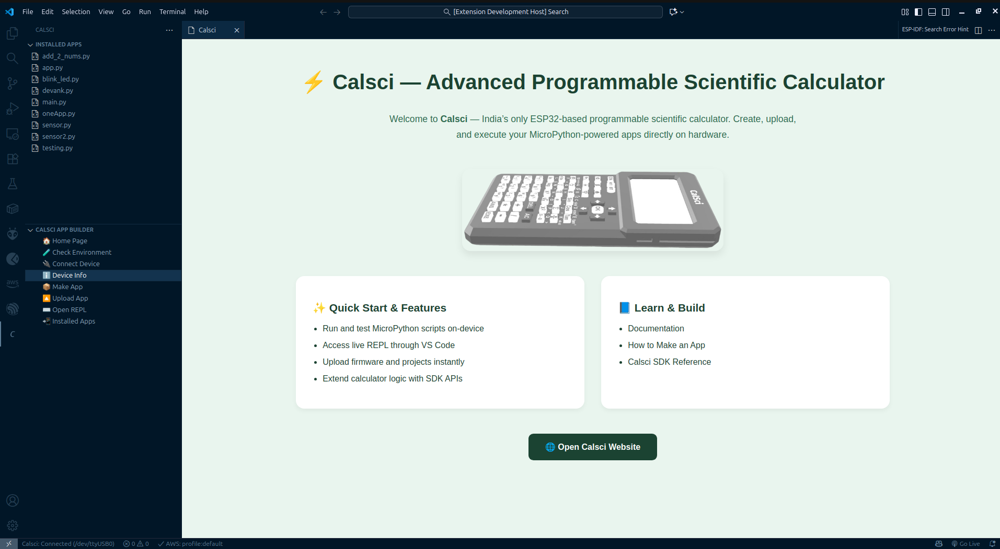

# Calsci: Scientific Programmable Calculator Extension

Welcome to **Calsci**! This extension transforms Visual Studio Code into a powerful development environment for the **Calsci Scientific Programmable Calculator**, an ESP32-based device running MicroPython.

Build, test, and upload your own custom calculator apps, functions, and tools with a seamless, one-click workflow.

**Visit the official website: [calsci.io](https://calsci.io)**

---

## See it in Action

Here's a visual guide to the Calsci Extension's user interface:



## 🚀 Key Features

- **🐍 MicroPython Powered:** Leverage the full power and simplicity of MicroPython to create complex scientific and mathematical applications.
- **💻 Integrated App Management:**
  - **Make App:** Instantly scaffold a new `app.py` in your workspace.
  - **Edit App:** Use the full power of VS Code's editor to write your code.
  - **Upload App:** Flash your application to the ESP32 with a single click.
  - **Choose File:** Upload any Python file (not just `app.py`) to your device.
- **⚡ Interactive Testing:**
  - **Open REPL:** Open a direct REPL session with your device to test code live.
  - **Device Info:** Quickly check firmware, memory, and other device details.
- **☁️ Calsci Cloud (Coming Soon!):**
  - Sign in to your Calsci account.
  - Upload your finished apps to the **Calsci Appstore** to back them up or share them with the community.
- **🔌 Smart Device Detection:** The extension automatically shows your device's connection status in the sidebar and status bar.

---

## ✅ Requirements

To use this extension, you will need:

- **Visual Studio Code** (v1.105.0 or higher)
- A **Calsci-compatible ESP32 device**
- **Python 3** installed on your computer
- **mpremote:** This extension uses `mpremote` in the background. Install it on your system with pip:
  ```bash
  pip install mpremote
  ```

---

## Workflow: Your First App in 60 Seconds

1.  Connect your Calsci (ESP32) device via USB.
2.  Open the **Calsci Sidebar** in VS Code (click the Calsci icon in the Activity Bar).
3.  Click **Make App** and select a folder. An `app.py` file will be created and opened.
4.  Write your MicroPython code.

    ```python
    # app.py
    def my_cool_function(x):
        return x * x

    print("My custom app is running!")
    ```

5.  Click **Upload App**. The extension will automatically find your `app.py` and send it to the device.
6.  Click **Open REPL** to interact with your code live and test your new function.

---

## 🛠️ How it Works (Under the Hood)

This extension is built using **Node.js** and **JavaScript** (TypeScript) for the VS Code API. It provides a clean graphical interface for powerful command-line tools.

When you click "Upload App," the extension doesn't reinvent the wheel. It uses Node.js's `child_process` module to run `mpremote` commands in the background.

- **`Make App`** simply creates a file using VS Code's workspace API.
- **`Upload App`** runs a command like `mpremote cp app.py :app.py` against the auto-detected serial port.
- **`Open REPL`** launches `mpremote repl` inside an integrated VS Code terminal, giving you direct access.

This approach combines the robust, official MicroPython tool (`mpremote`) with the user-friendly UI of VS Code.

---

## 📚 Useful Resources

- **[Calsci Official Website](https://calsci.io)**: News, documentation, and community.
- **[MicroPython Documentation](https://docs.micropython.org/)**: The official docs for the language.
- **[mpremote Reference](https://docs.micropython.org/en/latest/reference/mpremote.html)**: Learn more about the tool powering this extension.
- **[vscode extension API](https://code.visualstudio.com/api)**: Official vscode Extension API Docs.

---
